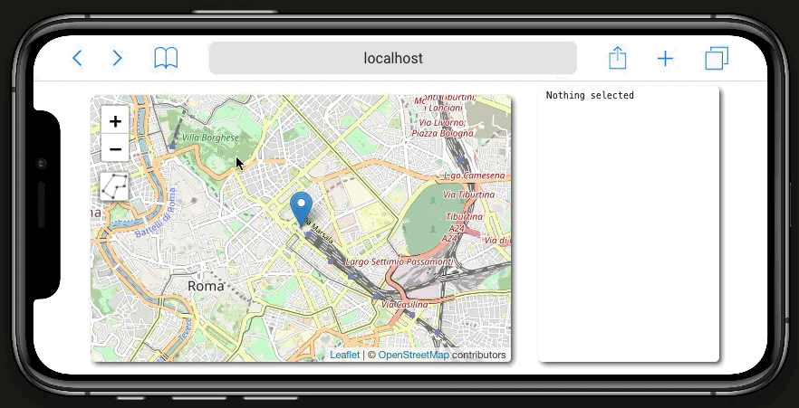

# @bopen/leaflet-area-selection

> Create and manipulate a polygonal area on a Leaflet map

[](https://www.npmjs.com/package/@bopen/leaflet-area-selection)

The primary target of this plugin is to obtain a **customizable selected area** while keeping **high usability**.

## Install

```bash
npm install --save @bopen/leaflet-area-selection
```

## Usage

```javascript
import L from 'leaflet';
import '@bopen/leaflet-area-selection/dist/index.css';
import { DrawAreaSelection } from '@bopen/leaflet-area-selection';

const map = L.map('root').setView([41.901493, 12.5009157], 13);

L.tileLayer('https://{s}.tile.openstreetmap.org/{z}/{x}/{y}.png', {
  attribution:
    '&copy; <a href="https://www.openstreetmap.org/copyright">OpenStreetMap</a> contributors',
}).addTo(map);

const areaSelection = new DrawAreaSelection();

map.addControl(areaSelection);
```

## Configuration

The `DrawAreaSelection` can receive a configuration object with followings supported options:

- `active` - the plugin starts as active, no need to run it from the button
- `fadeOnActivation` - when actively drawing a new area the map is partially faded out
- `onPolygonReady` - callback called every time a new complete polygon is ready.
  Receives the [Leaflet.Polygon](https://leafletjs.com/reference.html#polygon) and the control instance as arguments.
- `onPolygonDblClick` - called when performing a double-click on the draw polygon when in the adjustment phase (see below).
  Receives three arguments: the [Leaflet.Polygon](https://leafletjs.com/reference.html#polygon), the control instance and the event.

# User guide

When the plugin is activated by using the new control, the map enters in a **drawing phase**.<br>
Clicks on the map will trigger a creation of a polygon.

User can continue adding points to the polygon (min length is 3) until the whole required area is covered.<br>
To complete the polygon drawing phase user must click on the first (green) point created.

At this point we enter the **adjustment phase**, where user can:

- move edges of the polygon by dragging them
- create new edges, by dragging the ghost markers in the middle of every path
- deleting edges by double clicking on them



See also the [live example](https://bopen.github.io/leaflet-area-selection).

## Credits

This plugin is heavily inspired by the "_draw on map_" feature provided on [Immobiliare.it](https://www.immobiliare.it) website.

## License

MIT © [B-Open](https://www.bopen.eu/)


